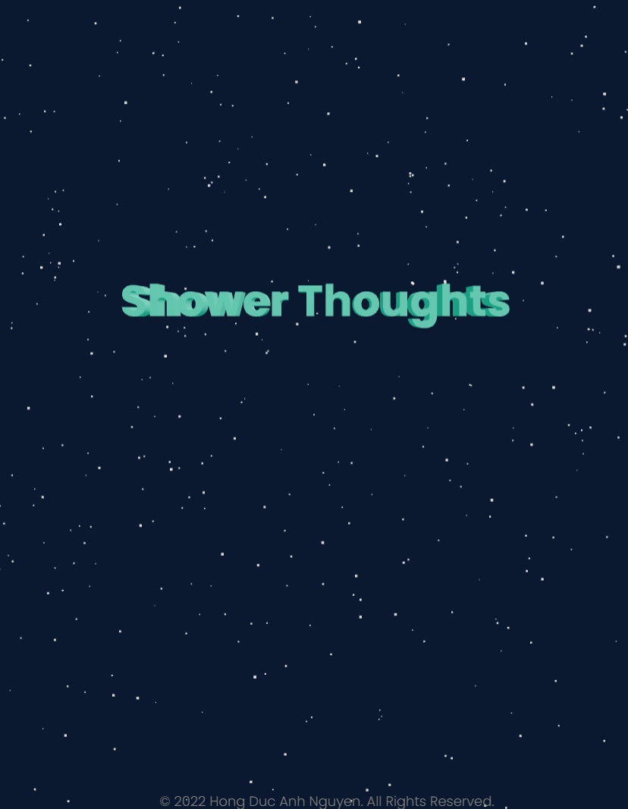

<h1 align="center">Shower Thoughts version 2.0 💡👨‍💻</h1>
<h2>About</h2>

A new version of my website for users to share their Epiphanies--Shower Thoughts, built with MERN stack, Redux and MUI

<h2>Preview</h2>
</img>
</img>
<h2>Installation and Setup Instructions</h2>

Clone down this repository. You will need node and npm installed globally on your machine.

1/ Installation:
Create mongo account, set up your database and add MONGODB_URI to your .env
npm install

2/ To Start Client Side:
cd client
npm start

3/ To Start Server Side:
cd server
nodemon

4/ To Visit App:
localhost:3000

<h2>Personal Reflection</h2>

This was my personal 3.5 week long Full Stack Project during my third Semester at Southern Alberta Institute of Technology. Project goals were achieved successfully, which were to implement the MERN stack, Redux, MUI, design patterns and software design principles which I had learned outside of school, and continued to polish and improve on since Summer 2022.

One of the main challenges I ran into was Authentication. This lead me to spend a few days researching JWT and other developer's approach on custom authorization.

I also took the extra mile to connect my App with a Reddit thread with the same name "Shower Thoughts" to let users generate with ease if they want any inspirations off of the internet with just a click of a button.

<h3 style="text-decoration:underline;">Estimated deployment date: early Jan 2023</h3>
