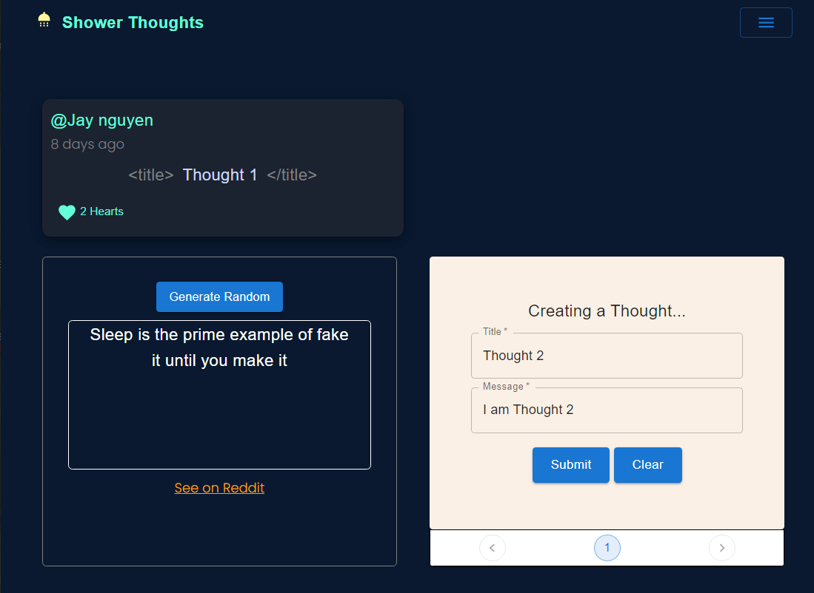

<h1 align="center">Shower Thoughts version 2.0 💡👨‍💻</h1>
<h2>About</h2>

A new version of my website for users to share their Epiphanies--Shower Thoughts, built with MERN stack, Three.js, Redux and MUI

<h2>Preview</h2>
</img>

https://user-images.githubusercontent.com/96758088/218382320-dde82bf8-7bd0-4e73-938e-175d87d5a85f.mp4

<h2>Installation and Setup Instructions</h2>

Clone down this repository. You will need node and npm installed globally on your machine.

1/ Installation and Setup:  
1.1: Create mongo account <a  href="https://account.mongodb.com/account/login" target="blank" alt="register with mongodb atlas">Here</a>, set up your database and add MONGODB_URI to your .env  
1.2: npm install  

2/ To Start Client Side: 
2.1: cd client 
2.2: npm start

3/ To Start Server Side: 
3.1: cd server 
3.2: nodemon

4/ To Visit App: 
4.1: localhost:3000

<h2>Personal Reflection</h2>

This was my personal 1 month long Full Stack Project during my third Semester at Southern Alberta Institute of Technology. Project goals were achieved successfully, which were to implement the MERN stack, Three.js, Redux, MUI, design patterns and software design principles which I had learned outside of school, and continued to polish and improve on since Summer 2022. Since this project was only worked on when I don't have classes, it took longer than expected to get the main functionalities completed. Nevertheless, I stayed consistent and saw good results, I will still be working on the UI since it still has room for improvement.

One of the main challenges I ran into was Authentication. This lead me to spend a few days researching JWT and other developer's approach on custom authorization.

I also took the extra mile to connect my App to a Reddit thread with the same name "r/Showerthoughts" to let users generate Shower Thoughts with ease if they want any inspirations off of the internet with just a click of a button.

<h3>Live Site: <a href="https://shower-thoughts-api.onrender.com/" title="go to site">Shower Thoughts</a></h3>
<h3>New features coming:</h3>
<ul><li> Post's Cover picture uploads and Change Cover</li></ul>
